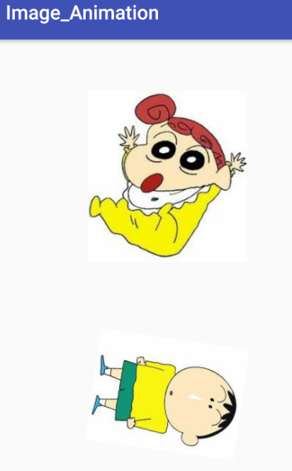

# Image_Animation - Image Rotations & Motions Android
Android_image_Animation
The project contains the certain animation types of image like mation one image into another image.
Then rotate the image in right and left and 365 degree.

